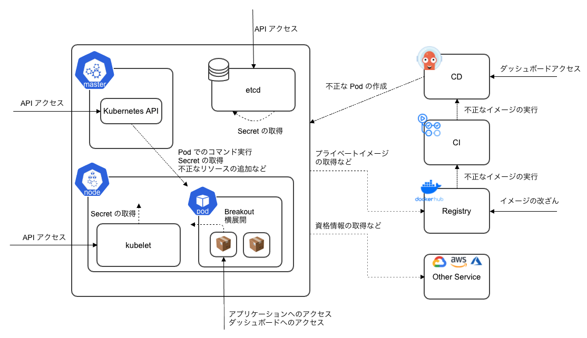

# Kubernetes Security

本章ではコンテナのオーケストレーションツールである Kubernetes への攻撃例とその対策を紹介します。

この図は Kubernetes クラスタにおける攻撃ベクターを示しています。Kubernetes のコンポーネントもそうですが、Kubernetes クラスタでは CI / CD ツールやダッシュボードなども密に連携するものも多く、アクセスされるとクラスタの管理者権限を取得される可能性があるため、それらのアプリケーションへの認証認可も適切に設定する必要があります。  
Kubernetes では多数のコンポーネントが存在しており、ここに記載している以外の攻撃経路も当然あるため、クラスタに対する Attack Surface を知ることが重要です。

その理解を助けるために Microsoft が作成している ATT&CK ライクな Kubernetes attack matrix が参考になります。[^1]

本章でここに記載されているすべての攻撃経路を紹介はできませんが、Kubernetes クラスタの設定ミスやコンテナが侵害された場合に焦点を当て、攻撃例とその対策を紹介します。

---

[^1]: https://www.microsoft.com/security/blog/2020/04/02/attack-matrix-kubernetes/
