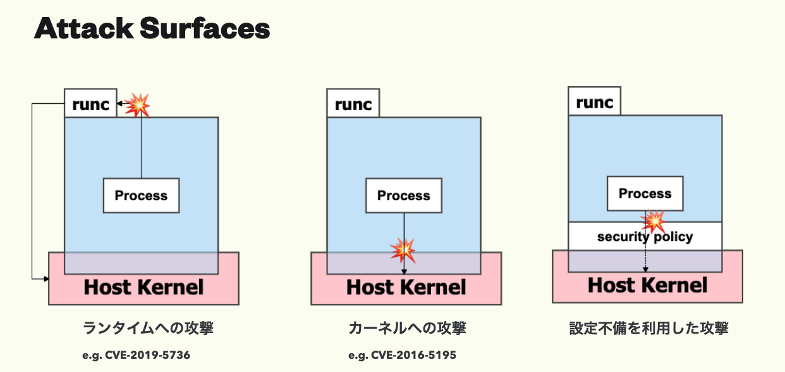

# コンテナのセキュリティと攻撃例

本章では[コンテナの基礎技術](../container-basics.md)で紹介した各保護レイヤに不備があった場合に生じる脆弱性や、バイパス手法について紹介します。

コンテナへの攻撃は「ランタイムの脆弱性を利用するもの」「カーネルの脆弱性を利用するもの」「コンテナの設定不備を利用するもの」などが考えられますが、本章では主に「コンテナの設定不備を利用するもの」に焦点をあてます。

ここで言うコンテナの設定不備というのは、例えば「Docker ソケットをコンテナにマウントする」「過剰な Capability を与える(Privileged コンテナ)」などを行うことを指します。  
Docker を触ってきた方ならこれらを一度は経験したことあるのではないでしょうか。これらを行うとなぜ危険なのかについて紹介していきます。
