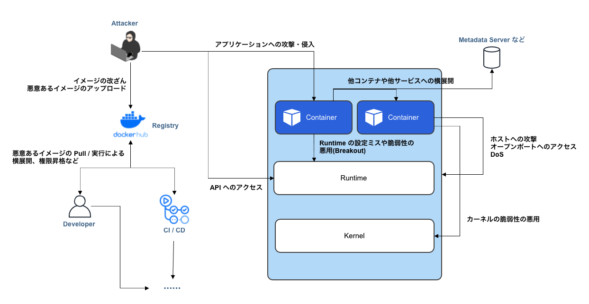

# コンテナのセキュリティと攻撃例

本章では[コンテナの基礎技術](../container-basics.md)で紹介した各保護レイヤに不備があった場合に生じる脆弱性や Docker のセキュリティについて紹介します。

コンテナへの攻撃経路として「ランタイムの脆弱性を利用するもの」「カーネルの脆弱性を利用するもの」「コンテナの設定不備を利用するもの」などが考えられます。  
また、コンテナ自体は開発環境や CI 環境でも利用されるケースが増え、不正な Docker イメージによって、それらの環境が侵害されるケースも考えられます。

コンテナに対して Capability を付与したり、特権(Privileged)コンテナを実行したりした経験がある方もいるかもしれません。そのようなコンテナが侵害された場合、ホスト側にエスケープ(Breakout)できてしまう可能性があります。ここでは、そのようなコンテナに対する攻撃例について取り上げ、セキュアなコンテナ運用のヒントを紹介します。
